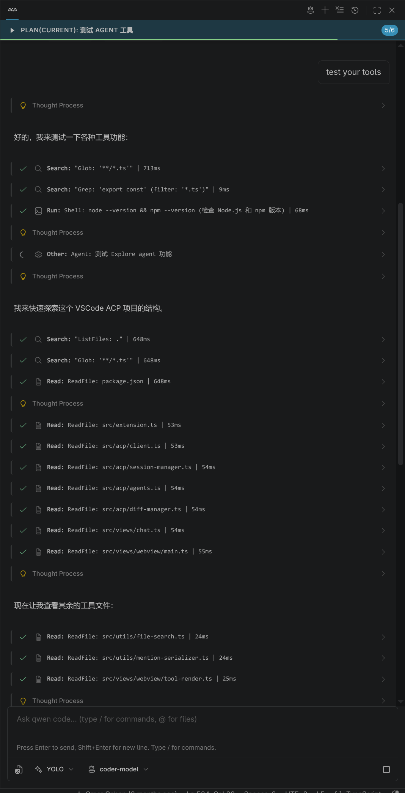

# VSCode ACP Chat

> AI coding agents in VS Code via the Agent Client Protocol (ACP)

[](LICENSE)

This project is based on [vscode-acp](https://github.com/omercnet/vscode-acp).

Chat with Claude, OpenCode, and other ACP-compatible AI agents directly in your editor. No context switching, no copy-pasting code.



## Features

- **Multi-Agent Support** — Connect to OpenCode, Claude Code, Codex CLI, Gemini CLI, Goose, and other ACP-compatible agents
- **Native Chat Interface** — Integrated sidebar chat that feels like part of VS Code
- **Tool Visibility** — See what commands the AI runs with expandable input/output and file diffs
- **Rich Markdown** — Code blocks, syntax highlighting, and formatted responses
- **Streaming Responses** — Watch the AI think in real-time with thought chunks display
- **Mode & Model Selection** — Switch between agent modes and models on the fly
- **Session History** — Load and resume previous conversations
- **Terminal Integration** — View terminal output with ANSI color support
- **File Change Tracking** — Review and rollback file modifications made by AI

## Requirements

You need at least one ACP-compatible agent installed:

- **[OpenCode](https://github.com/sst/opencode)**
- **[Claude Code](https://claude.ai/code)**

## Installation

### From VS Code Marketplace

1. Open VS Code
2. Go to Extensions (`Cmd+Shift+X` / `Ctrl+Shift+X`)
3. Search for "VSCode ACP Chat"
4. Click Install

### From VSIX

1. Download the `.vsix` file from Releases
2. In VS Code: `Extensions` → `...` → `Install from VSIX...`

## Usage

1. Click the **ACP** icon in the Activity Bar (left sidebar)
2. Click **Connect** to start a session
3. Select your preferred agent from the dropdown
4. Start chatting!

### Tool Calls

When the AI uses tools (like running commands or reading files), you'll see them in a collapsible section:

- **⋯** — Tool is running
- **✓** — Tool completed successfully
- **✗** — Tool failed

Click on any tool to see the command input and output.

## Configuration

The extension auto-detects installed agents. Supported agents:

| Agent        | Command                               | Detection      |
| ------------ | ------------------------------------- | -------------- |
| OpenCode     | `opencode acp`                        | Checks `$PATH` |
| Claude Code  | `npx @zed-industries/claude-code-acp` | Checks `$PATH` |
| Codex CLI    | `npx @zed-industries/codex-acp`       | Checks `$PATH` |
| Gemini CLI   | `gemini --acp`                        | Checks `$PATH` |
| Goose        | `goose acp`                           | Checks `$PATH` |
| Amp          | `amp acp`                             | Checks `$PATH` |
| Aider        | `aider --acp`                         | Checks `$PATH` |
| Augment Code | `augment acp`                         | Checks `$PATH` |
| Kimi CLI     | `kimi --acp`                          | Checks `$PATH` |
| Mistral Vibe | `vibe acp`                            | Checks `$PATH` |
| OpenHands    | `openhands acp`                       | Checks `$PATH` |
| Qwen Code    | `qwen --acp`                          | Checks `$PATH` |
| Kiro CLI     | `kiro-cli acp`                        | Checks `$PATH` |

## Development

```bash
# Install dependencies
npm install

# Compile
npm run compile

# Run in VS Code
# Press F5 to open Extension Development Host
```

## License

MIT License - see [LICENSE](LICENSE) file for details.

---

This project is based on [vscode-acp](https://github.com/omercnet/vscode-acp), maintaining the MIT open source license.
